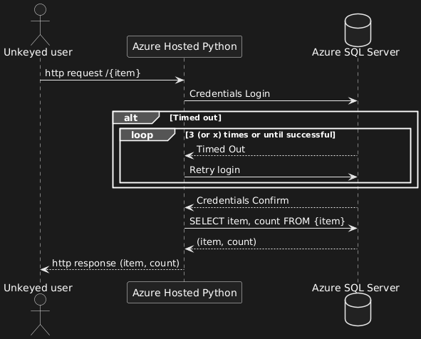

### Quick Overview of Functionality
Cloud tools are SQL Database and Cloud computing web app. Python for the logic and a Flask framework for quick and 
simple api setup. Logic is in three packages. SequelSupport handles the connection object to SQL database. 
SequelDAO dictates interaction with that object. whiskerlogic  handles the Flask api routing and some input validation.
Credentials are configured to the web app and referenced as environment details.
SQL database is as follows 

| item     | quantity | allocated |
|----------|----------|-----------|
| mp001    | 1748     | 233       |
| mp002    | 1974     | 45        |
| ep001    | 8675     | 309       |
| dmy-acc  | 15       | 3         |
| dmy-prod | 50       | 13        |
 
The access to the SQL database should take advantage of index search speeds if available. 
API only has get operations, there is no write capabilities exposed here. While there is little to no changing in data, 
it still suffers from the web app cold starts as it is a low traffic and for my wallet's I hope to maintain about as much 
traffic as the M.U.D. I frequent.  Below is a diagram that shows the process that occurs when a would be user uses the api.

Fig. 1

